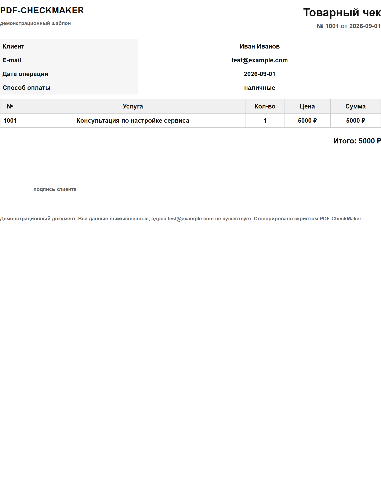

# PDF-CheckMaker

Скрипт-чекмейкер: генерирует PDF-чеки и закрывающие документы из HTML-шаблонов и CSV-данных. Windows и macOS.



> Это скриншот реального PDF, собранного из `demo/demo_receipt.html` и `demo/demo_orders.csv`.
> Открыть сам файл: [`docs/example-receipt.pdf`](docs/example-receipt.pdf).

---

## Быстрый старт

Одна команда — и в папке `output/` появятся готовые чеки:

```bash
python receipt_generator.py --demo
```

Команда не задаёт вопросов и использует готовые демо-файлы из папки `demo/`. PDF-движок выбирается автоматически, шрифт с кириллицей уже лежит в `fonts/`. Никакой подготовки не требуется.

Положить WeasyPrint (нужен только для PDF на macOS и Linux):

```bash
pip install -r requirements.txt
```

---

## Оффер

> Настрою для вас автоматическую генерацию PDF-чеков и закрывающих документов с помощью моего скрипта-чекмейкера, который легко интегрируется в ваши бизнес-процессы. Услуга идеально подойдет для интернет-магазинов, онлайн-школ и сервисов, которым нужно массово и без ошибок выдавать чеки клиентам сразу после оплаты. Вы получаете мгновенную выдачу документов, полную автоматизацию рутины и экономию десятков часов ручной работы.

---

## Как это работает

Два «ингредиента», которые скрипт соединяет:

- **HTML-шаблон** — бланк с пустыми местами `{{name}}`
- **CSV-файл** — таблица, где первая строка — названия колонок

Имя колонки в CSV должно совпадать с именем внутри `{{ }}`. Скрипт берёт нужную строку таблицы и подставляет значения в бланк.

```
templates/receipt.html    →   <p>Клиент: {{name}}</p>
data/orders.csv           →   name,date,product
                                    ↑        ↑
                          столбец name = значение
```

## Установка

```bash
pip install -r requirements.txt
```

Создание HTML работает вообще без установки зависимостей — `requirements.txt` нужен только для PDF.

## Запуск

```bash
python receipt_generator.py
```

Меню:

```
1. Создать один чек                 — один документ по одной записи
2. Создать документы для всех        — отдельный PDF для каждой строки CSV
3. Обновить список файлов           — после добавления файлов на диск
0. Выход
```

При выборе одного чека программа спрашивает по очереди: шаблон → CSV → запись → что создавать (`1` HTML и PDF, `2` только HTML, `3` только PDF). Везде можно ввести `0`, чтобы вернуться на шаг назад.

## Автоматический режим

Для скриптов и интеграций есть режим без вопросов: шаблон, CSV и записи передаются ключами, на выходе — код возврата.

```bash
# один чек по идентификатору записи
python receipt_generator.py --template invoice --csv clients --row INV-2001

# несколько записей через запятую: идентификаторы и номера строк можно смешивать
python receipt_generator.py --template invoice --csv clients --row INV-2001,INV-2003

# все записи файла, сразу HTML и PDF
python receipt_generator.py --template invoice --csv clients --all --format both
```

Шаблон и CSV можно указывать как полным путём, так и частью имени: `--template invoice` найдёт `invoice.html`, а `--csv clients` — `clients/clients.csv`. Если под запрос подходит несколько файлов, программа перечисляет их и ждёт уточнения, а не выбирает наугад.

Коды возврата:

| Код | Значение |
|---|---|
| `0` | документы созданы |
| `1` | ошибка: нет ключей, файл или запись не найдены, движок PDF недоступен |
| `2` | запись заблокирована из-за противоречий в данных |
| `130` | прервано пользователем |

Если противоречие найдено хотя бы в одной записи, код `2` возвращается всегда — так скрипт в CI или в 1С сразу увидит плохие данные. Создать документы с противоречиями можно только осознанно:

```bash
python receipt_generator.py --template invoice --csv clients --all --allow-contradictions
```

## Структура проекта

```
PDF-CheckMaker/
├── receipt_generator.py          # весь код
├── requirements.txt              # зависимости
├── README.md                     # этот файл
├── Промпт.md                     # исходное техническое задание
├── demo/                         # рабочий пример для --demo
│   ├── demo_receipt.html
│   └── demo_orders.csv
├── docs/                         # скриншот и пример PDF для README
│   ├── screenshot-demo.png
│   └── example-receipt.pdf
├── templates/                    # HTML-шаблоны
│   ├── receipt.html
│   └── invoice.html
├── data/                         # CSV с данными
│   ├── orders.csv
│   └── clients/
│       └── clients.csv
├── fonts/                        # Carlito (OFL-1.1) — кириллица «из коробки»
└── output/                       # готовые документы (в репозиторий не попадают)
```

## Возможности

- Демо одной командой: `--demo` собирает чеки из папки `demo/` без настройки
- Неинтерактивный режим с ключами `--template`, `--csv`, `--row`, `--all` и кодом возврата для автоматизации
- Проверка противоречий в датах: расхождение блокирует выпуск документа, обход — только явным ключом
- Рекурсивный поиск шаблонов и CSV в нескольких папках
- Один или все документы из CSV за один проход
- Подстановка `{{column}}` без Jinja2, значения экранируются для HTML
- Базовая таблица стилей для PDF: `table-layout: fixed`, `overflow-wrap: anywhere`, перенос длинных строк
- Кириллица в PDF через `@font-face` с локальным шрифтом и fallback `"Roboto", "Liberation Sans", Arial, sans-serif`
- Открытый шрифт Carlito в комплекте — русский текст выглядит одинаково на любом компьютере
- Безопасные имена файлов для Windows и macOS
- Открытие PDF системной программой просмотра (`os.startfile` / `open`)
- Автоопределение кодировки CSV: UTF-8, cp1251, KOI8-R
- Разделители CSV: запятая, точка с запятой, таб
- Никаких `traceback` на обычных пользовательских ошибках

## Данные клиентов и приватность

В репозитории лежат только вымышленные данные: `Иван Иванов`, `ООО «Ромашка»`, адрес `test@example.com`. Реальных имён, телефонов и сумм там нет.

`.gitignore` закрывает пути утечки:

- `output/` — готовые документы с реальными данными клиентов
- `data/` — рабочие CSV (в репозитории остаются только демонстрационные файлы)
- `*.env`, `*.log`, `__pycache__/`, `.DS_Store`

Перед тем как положить свои рабочие CSV в `data/`, стоит решить, нужны ли они в git: по умолчанию они игнорируются. Шрифты из `fonts/` тоже игнорируются, кроме открытого Carlito.

## Проверка данных на противоречия

Срок, сумма или количество не должны быть записаны дважды в разных местах — иначе документ читается неоднозначно. Скрипт проверяет это перед генерацией.

Проверить все CSV, ничего не создавая:

```bash
python receipt_generator.py --check
```

Проверяются фразы о сроке в свободном тексте («до конца месяца», «в течение N дней», «не позднее N числа»), даты внутри текста и две разные колонки-срока. Разные даты у разных фактов — например, дата выставления и срок оплаты — ошибкой не считаются.

Пример срабатывания:

```
[!] Противоречие в данных записи number=INV-2001:
    явное расхождение: поле «comment» — «до конца месяца» от 5 сентября 2026
        = 30 сентября 2026 (2026-09-30)
        поле «due_date» = 20 сентября 2026 (2026-09-20), расхождение 10 дн.
        текст: Оплата до конца месяца
    Один и тот же срок задан дважды по-разному. Уберите срок из свободного
    текста или исправьте колонку.

  1. Прервать, данные требуют исправления
  2. Создать документ несмотря на противоречие

Выберите пункт:
```

Пустой ввод здесь ничего не пропускает: нажать Enter недостаточно, нужно выбрать пункт явно. В автоматическом режиме противоречие блокирует выпуск документа и даёт код возврата `2`.

## Шаблоны

Плейсхолдеры соответствуют названиям колонок CSV:

```html
<p>Клиент: {{name}}</p>
<table>
    <tr><th>Товар</th><th>Количество</th><th>Цена</th></tr>
    <tr><td>{{product}}</td><td>{{quantity}}</td><td>{{price}}</td></tr>
</table>
```

Неизвестные плейсхолдеры остаются в документе как есть, а программа сообщает, каких полей не хватает. Лишние колонки CSV просто игнорируются.

Имя файла шаблона становится основой имени результата: `receipt.html` и запись `1001` дают `output/receipt_1001.pdf`.

## Шрифты

В папке `fonts/` уже лежит **Carlito** (лицензия OFL-1.1, см. `fonts/OFL.txt`) — открытый шрифт с полной кириллицей. Программа подключает его через `@font-face`, поэтому русский текст в PDF выглядит одинаково на любом компьютере сразу после клонирования.

Свои шрифты тоже поддерживаются: положите `Roboto-Regular.ttf` или любой другой `.ttf` в `fonts/` — они подключатся автоматически. Если локальных шрифтов нет, используется системный, и текст остаётся читаемым.

## Создание PDF

По умолчанию — WeasyPrint. На macOS достаточно `pip install`. На Windows WeasyPrint требует нативных библиотек GTK/Pango, которые `pip` не ставит, поэтому есть запасной движок:

```bash
python receipt_generator.py --pdf-engine auto
```

В этом режиме PDF создаётся через headless-браузер (Chrome, Edge, Chromium или Brave) — устанавливать ничего не нужно.

## Ключи командной строки

| Ключ | Назначение |
|---|---|
| `--dirs ПАПКА...` | свои папки для поиска `.html` и `.csv` |
| `--output ПАПКА` | другая папка для результатов |
| `--fonts ПАПКА` | папка со шрифтами |
| `--pdf-engine ДВИЖОК` | `weasyprint` (по умолчанию), `auto`, `browser` |
| `--template ШАБЛОН` | имя или путь HTML-шаблона. Вместе с `--csv` включает неинтерактивный режим |
| `--csv ФАЙЛ` | имя или путь CSV-файла |
| `--row ID` | идентификаторы записей через запятую: значение колонки `id`/`number` или номер строки |
| `--all` | обработать все записи выбранного CSV |
| `--format ФОРМАТ` | `pdf` (по умолчанию), `html`, `both` |
| `--allow-contradictions` | создавать документы даже при противоречиях; по умолчанию они блокируются, код возврата `2` |
| `--demo` | демо-запуск без вопросов: сборка чеков из `demo/` в `output/` |
| `--check` | только проверить данные, ничего не создавать |
| `--no-open` | не открывать PDF после создания |

## Требования

- Python 3.9+
- `weasyprint` — для PDF, подробности в [requirements.txt](requirements.txt)
- Браузер Chrome, Edge, Chromium или Brave — если используется `--pdf-engine auto`
- Шрифты и зависимости для PDF уже включены: `fonts/Carlito-*.ttf` и `requirements.txt`

Лицензия кода: MIT. Шрифт Carlito — OFL-1.1, см. [fonts/OFL.txt](fonts/OFL.txt).

---

## Нужна такая же автоматизация под ваш проект?

Этот репозиторий — рабочая основа, а не только чекмейкер. Под вашу задачу дорабатываю за часы, а не за недели.

**Что обычно нужно бизнесу и решается на базе этого скрипта:**

- **Массовая выдача документов после оплаты.** Интернет-магазины, онлайн-школы, студии и сервисы с подпиской: чеки, счета, акты и закрывающие документы выходят пачкой по команде или автоматически, а не вручную по одному.
- **Собственный бланк и свой стиль.** Переношу ваш фирменный шаблон, логотип, реквизиты, нумерацию документов — результат выглядит как часть вашего сервиса, а не как чужой генератор.
- **Выгрузка из вашей системы.** 1С, Excel, Google Таблицы, CRM или API — документы собираются прямо из ваших данных, без ручного копирования строк в CSV.
- **Проверка данных перед выпуском.** Противоречивые даты, суммы и сроки блокируются до формирования документа, а не всплывают у клиента. Скрипт уже умеет это делать.
- **Запуск по расписанию и из CI.** Windows Task Scheduler, cron или GitHub Actions: чеки создаются без участия человека, с кодом возврата для системы автоматизации.
- **Пакетная обработка и интеграция.** Неинтерактивный режим с `--template`, `--csv`, `--row`, `--all` уже готов — подключается к вашему пайплайну.

**Как это выглядит на практике:** вместо 30 минут ручной работы в день на каждого клиента вы получаете одну команду или один вызов функции. Чеки выдаются сразу после оплаты, нумерация не сбивается, ошибки не попадают к клиентам.

**Что нужно от вас для старта:** пример документа, который хотите выдавать (можно файл или фото), и то, из каких данных он формируется. Дальше я предлагаю вариант шаблона, вы согласовываете — и забираете готовое решение.

📩 **Напишите мне в Telegram:** [@nmhtt2481](https://t.me/nmhtt2481)

Коротко опишите задачу — отвечу, сколько это займёт времени и сколько стоит. Консультация по вашему сценарию бесплатна.

---

### Отзывы и вклад

Этот проект открытый. Если он оказался полезным:

- ⭐️ Поставьте звезду на [странице репозитория](https://github.com/nmhtt2481-create/PDF-CheckMaker) — это лучшая благодарность и лучший способ найти его через поиск.
- 🐛 Нашли ошибку или неудобный сценарий? Откройте Issue — правлю быстро.
- 🍴 Хотите свой шаблон или движок? Pull request приветствуется.

Ваши чеки и данные клиентов в репозиторий не попадают: `output/` и рабочие `data/` закрыты в `.gitignore`.